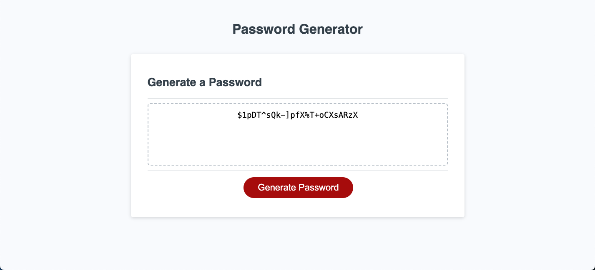

# Random Password Generator
Module 5 Challenge for EDX Bootcamp in Front End Web Development

<!-- TABLE OF CONTENTS -->

  
Table of Contents

  <ol>
    <li>
      <a href="#description">Description</a>
      <ul>
        <li><a href="#built-with">Built With</a></li>
      </ul>
    </li>
    <li>
        <a href="#installation">Installation</a>
    </li>
    <li><a href="#usage">Usage</a></li>
    <li><a href="#license">License</a></li>
    <li><a href="#contact">Contact</a></li>
    <li><a href="#acknowledgments">Acknowledgments</a></li>
  </ol>

<!-- ABOUT THE PROJECT -->
## Description

 
 
This was the 5th homework challenge for the EDX Bootcamp in Front End Development.
 

   
Our task was to create an application that an employee can use to generate a random password based on criteria they’ve selected.

 

 
The user is prompted to choose a password length between 8 and 128 inclusive.

 

 
We were provided with 4 arrays of data for specific characters the the user could choose to include in their password.

 

* Special Characters
* Numbers
* Lower Case Characters
* Upper Case Characters

 
Once a user has selected their chosen characters and password length they will be presented with a random password in the text area field that they can then copy.

 

### Built With

* 
* 
* 

## Installation

N/A

<!-- USAGE EXAMPLES -->
## Usage

To use this project, please open the website in Chrome and then click the 'Generate Password' button.

You will be prompted to enter a number between 8 and 128, this will be the length of your password. If your number is not within this range you will be asked to choose again.

You will then be asked to confirm what Characters you would like to include in your password: Special Characters, Numbers, Lower Case Characters, and Upper Case Characters. You can choose to select all or only some options, but you must select at least one option or you will be prompted to choose again. For each character set selected at least one of the characters from that set will appear in your password.

Once you have made your character set choices your password will be output to the text area field, which can then be copied.

<!-- LICENSE -->
## License

Distributed under the MIT License. See `LICENSE.txt` for more information.

<!-- CONTACT -->
## Contact

Richard Llewellyn - richard.lee.llewellyn@gmail.com 

Project Link: [https://richllew182.github.io/password-generator/](https://richllew182.github.io/password-generator/)

Project Repo Link: [https://github.com/RichLlew182/password-generator](https://github.com/RichLlew182/password-generator)

<!-- ACKNOWLEDGMENTS -->
## Acknowledgments

* [Img Shields](https://shields.io)
* [Best README Template](https://github.com/othneildrew/Best-README-Template)

